

    
    <h2 align="center">Rosé Pine Wallpapers</h2>

All natural pine, faux fur and a bit of soho vibes for the classy minimalist

    

## Table of contents

- [Illustration](#illustration)
- [Generative](#generative)
- [OS](#os)
- [Minecraft](#minecraft)
- [Photography](#photography)

## Illustration

**_Block Wave Dawn_ by [ng-hai](https://github.com/ng-hai)**

**_Block Wave Moon_ by [ng-hai](https://github.com/ng-hai)**

**_Something Beautiful in Nature_ by [mvllow](https://github.com/mvllow)**

> Alternative sizes: [Mobile](illustration/something-beautiful-in-nature-mobile.jpg)

**_Leafy_ by [fvrests](https://github.com/fvrests) (static or [dynamic](illustration/leafy-dynamic.heic))**

**_Leafy (Moon)_ by [fvrests](https://github.com/fvrests)**

**_Leafy (Dawn)_ by [fvrests](https://github.com/fvrests)**

**_Birb_ by [vidy007](https://github.com/vidy007)**

**_Portal Cake_ by [vidy007](https://github.com/vidy007)**

**_Sum of n³ (n=1..9) = 2025_ by [kirasok](https://github.com/kirasok)**

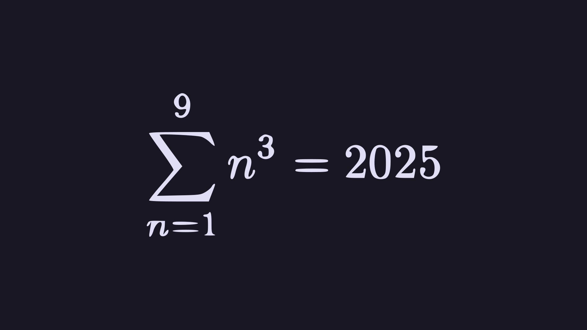

**_Sum of n³ (n=1..9) = 2025 (Moon)_ by [kirasok](https://github.com/kirasok)**

**_Sum of n³ (n=1..9) = 2025 (Dawn)_ by [kirasok](https://github.com/kirasok)**

**_Ascii_ by [Kelpwave](https://github.com/kelpwave)**

**_Ascii (Dawn)_ by [Kelpwave](https://github.com/kelpwave)**

## [Generative](https://github.com/chunghha/go-rosepine-genart)

**_Circle_ by [Chunghha](https://github.com/chunghha)**

**_Circle 2_ by [Chunghha](https://github.com/chunghha)**

**_Contour Line_ by [Chunghha](https://github.com/chunghha)**

**_Maze_ by [Chunghha](https://github.com/chunghha)**

**_Noise Line_ by [Chunghha](https://github.com/chunghha)**

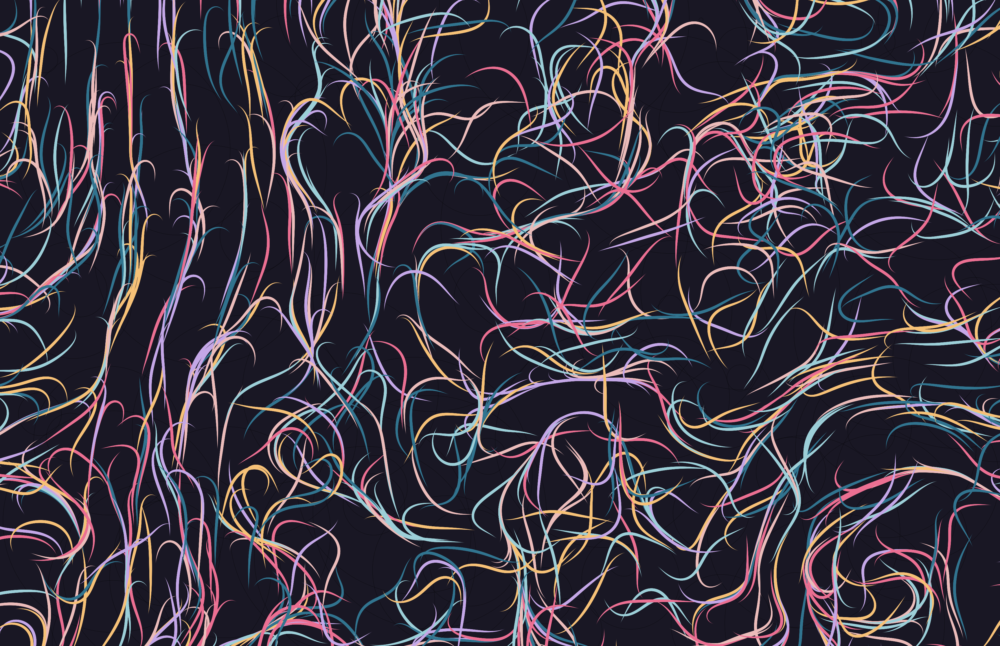

**_Shape_ by [Chunghha](https://github.com/chunghha)**

## OS

**_Linux_ by [Henrique](https://github.com/Henriquehnnm)**

**_Debian_ by [Henrique](https://github.com/Henriquehnnm)**

**_Arch_ by [Henrique](https://github.com/Henriquehnnm)**

**_Fedora_ by [Henrique](https://github.com/Henriquehnnm)**

**_Windows_ by [Henrique](https://github.com/Henriquehnnm)**

**_Windows 11_ by [Smolder](https://github.com/smolderdev)**

**_Mac_ by [Henrique](https://github.com/Henriquehnnm)**

**_Arch BTW_ by [Henrique](https://github.com/Henriquehnnm)**

**_Arch BTW (Moon)_ by [Henrique](https://github.com/Henriquehnnm)**

**_Arch BTW (Dawn)_ by [Henrique](https://github.com/Henriquehnnm)**

## Minecraft

**_Snow Pine Forest_ by [ne](https://github.com/neyfua)**

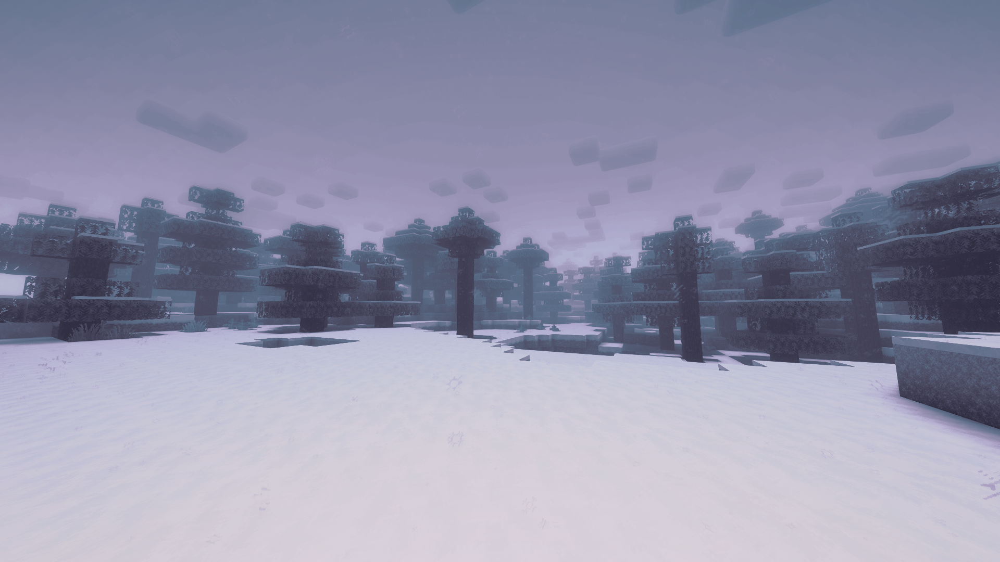

**_Snow Mountain Range_ by [ne](https://github.com/neyfua)**

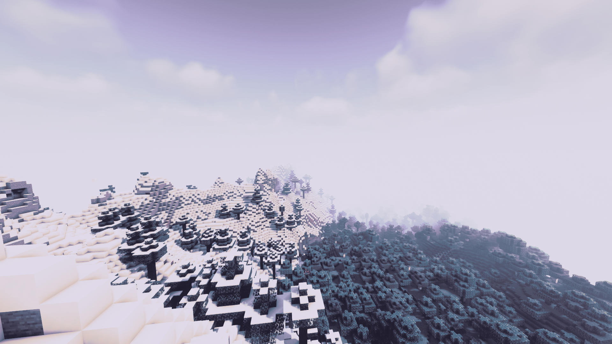

**_Snow Hills Sunset_ by [ne](https://github.com/neyfua)**

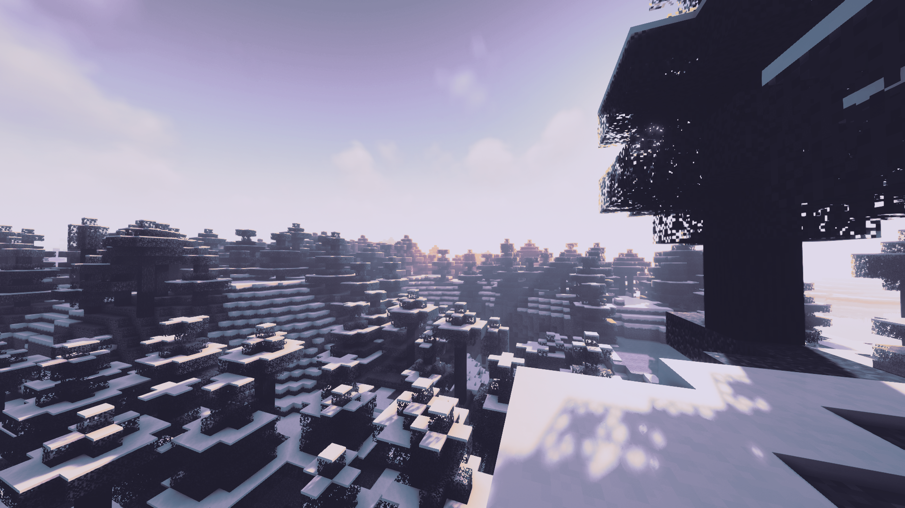

**_Snow Plains Evening_ by [ne](https://github.com/neyfua)**

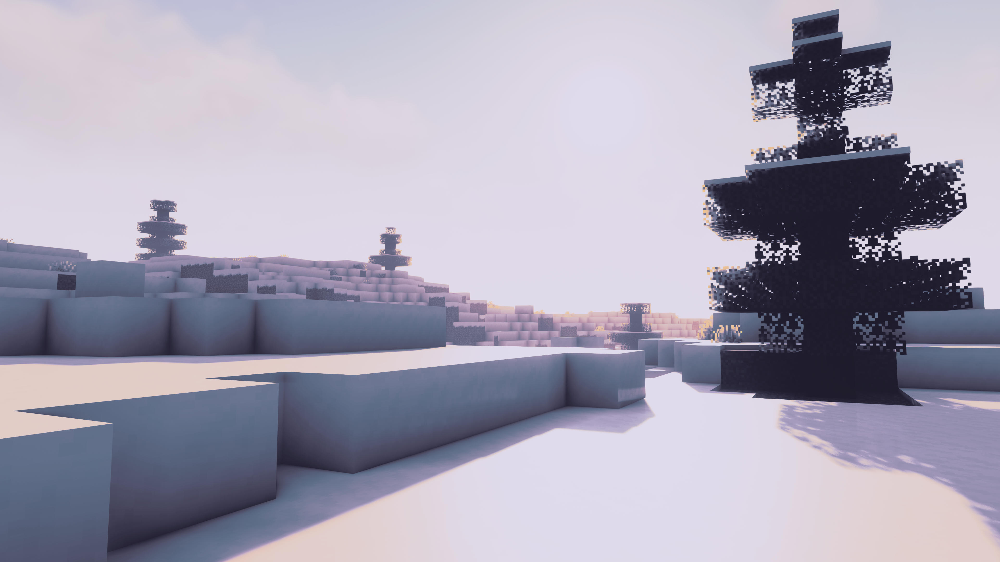

**_Snow Night Moon_ by [ne](https://github.com/neyfua)**

**_Snow Desert Sunset_ by [ne](https://github.com/neyfua)**

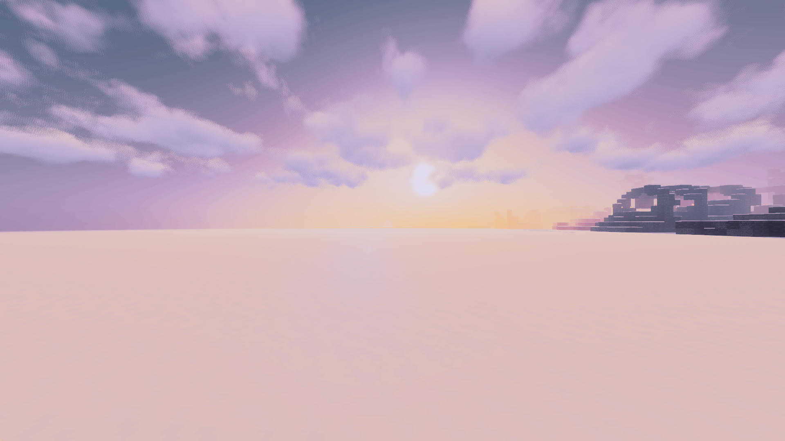

**_Cave Sunset View_ by [ne](https://github.com/neyfua)**

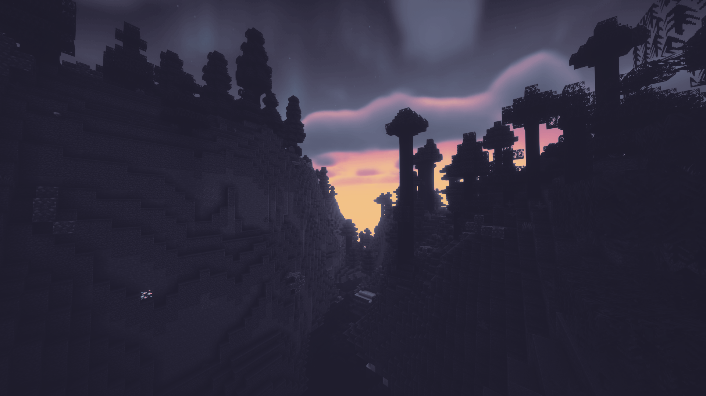

**_Dark House Rain_ by [ne](https://github.com/neyfua)**

**_Intaria Triple_ by [nnhomoli](https://github.com/nnhomoli)**

**_Stahlgrave Tower_ by [nnhomoli](https://github.com/nnhomoli)**

**_Tengoku Below_ by [nnhomoli](https://github.com/nnhomoli)**

**_Tengoku Overtop_ by [nnhomoli](https://github.com/nnhomoli)**

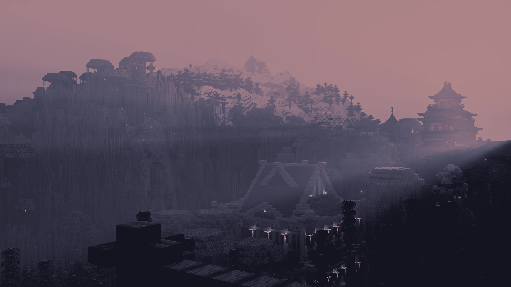

**_Tengoku Underthee_ by [nnhomoli](https://github.com/nnhomoli)**

## Photography

> *All photographs below are licensed as [CC BY-SA 4.0](https://creativecommons.org/licenses/by-sa/4.0/deed.en)*

### Photos by Kainoa Kanter

**_Moon_ by [Kainoa Kanter](https://github.com/thatonecalculator)**

**_Clouds_ by [Kainoa Kanter](https://github.com/thatonecalculator)**

**_Bay_ by [Kainoa Kanter](https://github.com/thatonecalculator)**

**_Flower_ by [Kainoa Kanter](https://github.com/thatonecalculator)**

**_Field_ by [Kainoa Kanter](https://github.com/thatonecalculator)**

**_Ocean Drone I_ by [Kainoa Kanter](https://github.com/thatonecalculator)**

**_Ocean Drone II_ by [Kainoa Kanter](https://github.com/thatonecalculator)**

**_Point Overhead_ by [Kainoa Kanter](https://github.com/thatonecalculator)**

**_Rocks_ by [Kainoa Kanter](https://github.com/thatonecalculator)**

**_Roses_ by [Kainoa Kanter](https://github.com/thatonecalculator)**

**_Seals_ by [Kainoa Kanter](https://github.com/thatonecalculator)**

**_Sea Slug_ by [Kainoa Kanter](https://github.com/thatonecalculator)**

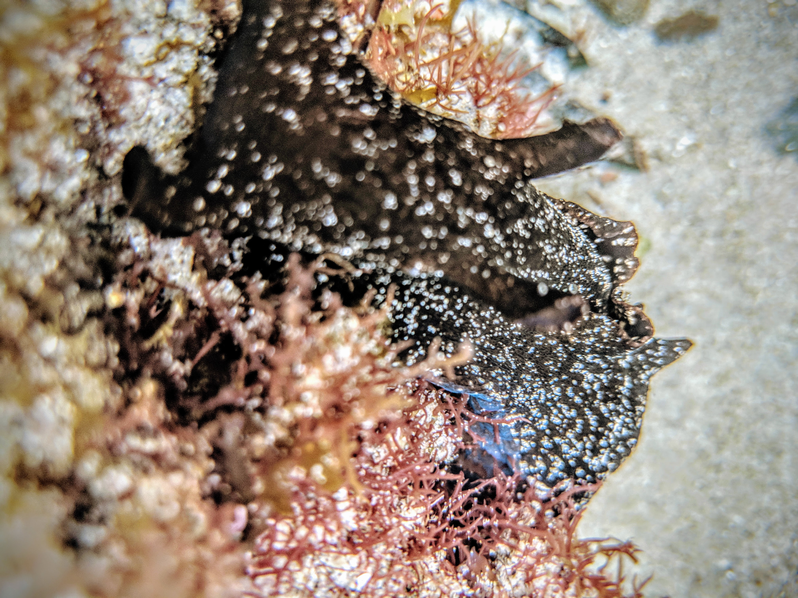

### Photos by single_celled_photography

**_River_ by [single_celled_photography](https://www.instagram.com/single_celled_photography/)**

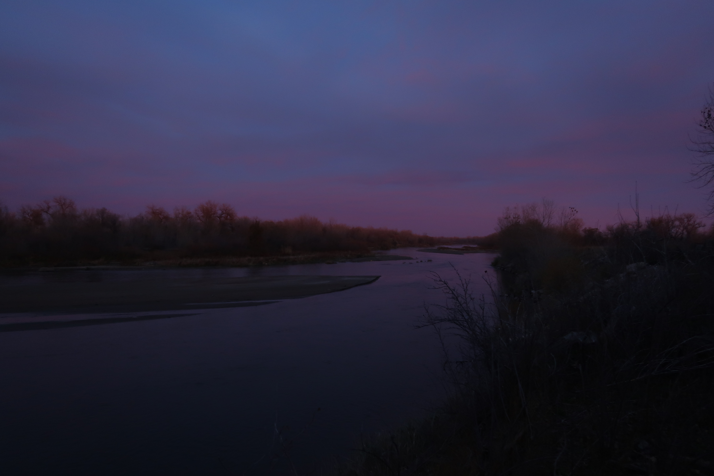

**_River Tree_ by [single_celled_photography](https://www.instagram.com/single_celled_photography/)**

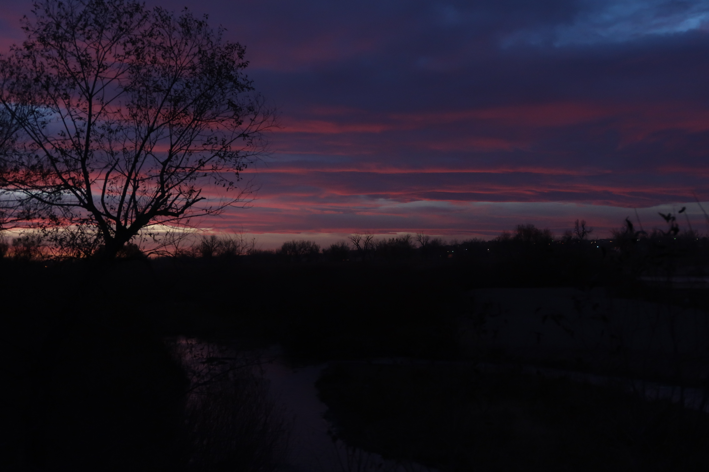

**_Through the Branches_ by [single_celled_photography](https://www.instagram.com/single_celled_photography/)**

